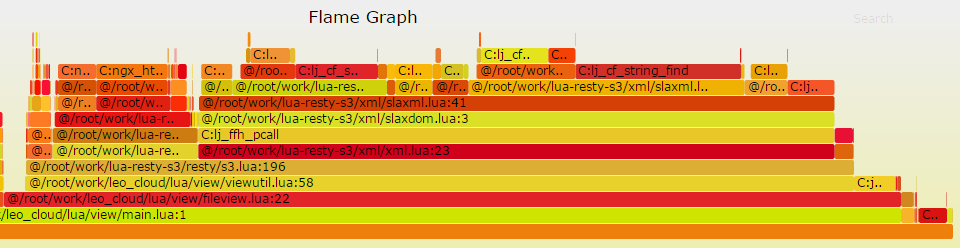
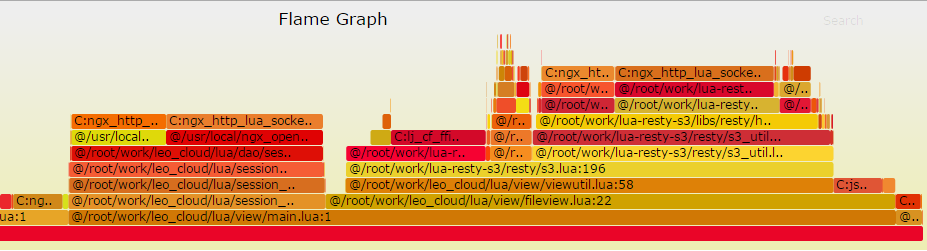

# ngx_lua介绍
---------------------
##### 安装
使用openresty官方安装包，
网址：https://openresty.org/
一般使用最新的Release版本。

##### 相关地址
* openresty 官网：https://openresty.org/
* ngx-lua 文档：https://github.com/openresty/lua-nginx-module
* http_load 官网：http://www.acme.com/software/http_load/
* nginx-systemtap-toolkit: https://github.com/openresty/nginx-systemtap-toolkit

##### luajit
LuaJIT是lua的一个及时编译器，运行速度较lua原生实现会有大幅提高，所以总是建议使用LuaJIT来运行lua程序。
同时由于LuaJIT支持通过ffi来调用C/C++编写的动态库。

# ngx_lua使用介绍
-----------------------------

### 常遇到的陷阱
-----------------------------

* ngx.ctx

```
ngx.ctx保存的变量只在当前上下文有效，如果在nginx.conf中有配置通过error_page方式进行跳转，由于上下文已经切换ngx.ctx中的变量肯定已经不存在了。
```

* POST请求，读取消息体前，需要调用ngx.req.read_body

```
对于POST请求，在调用ngx.req.get_post_args()或ngx.req.get_body_data()之前必须先调用ngx.req.read_body()方法，否则读取不到内容。
```

* ngx.req.get_uri_args(), ngx.req.get_headers()，ngx.req.get_post_args()返回值问题

```
这几个方法返回的都是一个table,table中是key:value对。一般情况下，key都是字符串，值也都是字符串，但是当一个参数出现多次，或一请求头出现多次时，值就成了table。如：
请求参数为：name=value1&name=value2
ngx.req.get_uri_args()['name']的值就变成{"value1", "value2"}
这时如果不做处理就当成字符串使用，就会造成异常。通常的处理办法是：
取值的第一个，或最后一个，比如：
local name = ngx.req.get_uri_args()['name']
if type(name)=='table' then
    name = name[1] -- 取第一个
    name = name[#name] --取最后一个
end
```

* access_by_lua及rewrite_by_lua中的异常。

```
在access_by及rewrite_by阶段执行的脚本，如果出现异常，会导致请求变成500错误。所以在在这两个阶段执行的代码，需要使用一个函数封装起来，然后通过pcall调用该函数,如：
local function func001()
    -- init the system.
end

local ok, exp = pcall(func001)
if not ok then
    ngx.log(ngx.ERR, "call func001() failed! err:", exp)
end
```

* 客户端停止请求

```
当客户端请求服务时，如果服务器响应时间比较长，用户可能会点击停止按钮，停止当前请求，这时在服务器如果未进行处理，可能会造成资源泄露。如下代码：
        location /test {
            content_by_lua '
                ngx.log(ngx.ERR, "-------- begin ---------")
                local res = ngx.location.capture("/sleep")
                ngx.log(ngx.ERR, "-------- end -----------")
            ';
        }

        location /sleep {
            content_by_lua 'ngx.sleep(10); ngx.say("OVER")';
        }
正常情况下，begin输出10秒后，end也会输出，但是如果在浏览器打开该地址两秒，点击停止，则end永远不会输出，请求直接结束了。
如果上面的begin与end分别是文件打开与关闭，或者内存的申请与释放(ffi)，就会出现文件句柄的泄露。
```
解决方法是，在所有操作执行之前，注册:ngx.on_abort回调函数。如下示例：
```
    location /test {
        content_by_lua '
            local function my_cleanup()
                ngx.log(ngx.ERR, "------------ abort end -------------")
                ngx.log(ngx.ERR, "------------ cleanup -------------")
            end
            local ok, err = ngx.on_abort(my_cleanup)
            if not ok then
                ngx.log(ngx.ERR, "failed to register the on_abort callback: ", err)
                ngx.exit(500)
            end
            ngx.log(ngx.ERR, "------------ begin -------------")
            local res = ngx.location.capture("/sleep")
            ngx.log(ngx.ERR, "------------ end -------------")
        ';
    }

    location /sleep {
        content_by_lua 'ngx.sleep(10); ngx.say("OVER")';
    }
```
注意：ngx.on_abort使用前必须先设置`lua_check_client_abort on;`

### 常用指令介绍(nginx.conf中设置)
------------
&nbsp;&nbsp;指令列表在 (https://github.com/openresty/lua-nginx-module#directives)
* lua_code_cache

```
代码缓存是否打开。
打开时(lua_code_cache=on)，代码会进行缓存，代码修改后，需要通过reload来加载。
关闭时(lua_code_cache=off)，代码不缓存，每次请求都会重新加载。
```
对于通过require加载的模块，缓存`打开时`时，只会在首次执行进行加载，并执行模块中的代码，例如如下代码，是对模块进行一次初始化的标准写法：

```
local _M = {}

local function init()
	local str = "------------ module init ---------"
	ngx.log(ngx.INFO, str)
	ngx.say(str)
end

_M.init = init()

return _M
```
但是如果将缓存`关闭时`时，以上代码每次require都会进行初始化。如果处理不当，这可能引起BUG。

*线上环境请总是打开代码的缓存。*

* init_by_luaXXX

```
全局初始化，一般用于对一些库进行一次性初始化，比如：
1：ffi初始化 ffi.cdef
2: 全局timer，协程启动。
```

* init_worker_by_luaXXX

```
nginx worker启动时执行的初始化，一般用于启动timer,协程等：
```

* content_by_lua CONTENT处理阶段，直接处理业务逻辑。
* rewrite_by_lua REWRITE处理阶段，进行URL的rewrite相关处理。
* access_by_lua ACCESS处理阶段，进行权限检查相关处理。
* log_by_lua LOG阶段处理，进行日志处理，统计处理。
* lua_socket_XXX luasocket相关的全局设置。

### 常用api介绍
---------
&nbsp;&nbsp;API列表在 (https://github.com/openresty/lua-nginx-module#nginx-api-for-lua)
* ngx.var, 引用nginx变量，包括：
    * 通过set, set_by_lua 设置的变量
    * GET参数变量：ngx.var.arg_XXX 引用变量`XXX`
    * 请求头变量：ngx.var.http_X_HEAD 引用请求头`X-HEAD`
* ngx.ctx的使用

```
ngx.ctx实际上是个table, 可以保存在当前请求上下文中使用的数据。请求完成后该上下文自动销毁。ngx.ctx可以保存任意类型的数据。

比较常用的是在rewrite_by_lua_xxx, access_by_lua_xxx, 与content_by_lua_xx 之间共享数据。
access_by_lua '
local cookie = read_cookie()
local userinfo = get_userinfo_by_cookie(cookie);
ngx.ctx.userinfo = userinfo
;
content_by_lua '
    local userinfo = ngx.ctx.userinfo
    -- 使用该userinfo
';
```

* ngx.location.capture

```
发起一个内部HTTP请求。该函数只能请求本server内部的URL。即URL只能以/开头的。
如果需要进行外部请求推荐使用开源库：
https://github.com/pintsized/lua-resty-http
```

* ngx.header

```
设置(或清除)响应头。因为请求头KEY不区分大小写，下面的设置的是同一个header，最后值为value3
ngx.header["TEST"] = "value1"
ngx.header["test"] = "value2"
ngx.header.tEst = "value3"
```

* ngx.req.get_headers

```
获取请求头，返回的是一个table。
使用：local headers = ngx.req.get_headers()
可通过 headers["TEST"]来引用一个请求头，同样不区分大小写，下面即种写法是获取同一个请求头：
headers["TEST"]
headers["tEst"]
headers.test
```

* ngx.req.get_uri_args & ngx.req.get_post_args

```
获取GET/POST请求参数。返回是一个table。注意，参数是区分大小写的。
```

* ngx.send_headers & ngx.flush

```
发送请求头，刷新body输出。
ngx.send_headers()调用之后，不能再修改响应头。
```

* tcpsock:*

```
TCP Socket客户端实现，非阻塞。基于它可以实现各种高效的网络客户端。比如常用的lua-resty-mysql, lua-resty-redis都是使用此库实现。
```

* udpsock:*

```
UDP Socket客户端实现，非阻塞。
```

# 缓存数据
------------------
程序中经常需要缓存一些数据，一般有如下几种数据需要缓存：
* 缓存数据库，redis的程序数据，一般是KEY: VALUE形式。这种缓存一般推荐使用：ngx.shared(https://github.com/openresty/lua-nginx-module#ngxshareddict)。 其具有自动过期机制。如果要保存的值是table,可通过cjson把table格式化成string再只在。
* 临时缓存数据，作批量处理。一般是需要将请求的数据保存到一定数据，再发送/存储。这种缓存一般推荐直接使用模块变量。类似下面这种方式：

```lua
-- cache.lua
local _M = {}
_M.logs = {}
return _M

-- post_log.lua
local cache = require("cache")
local log = get_log_from_request()
table.insert(cache.logs, log)
```
* 需要注意的是：模块变量的方式，只在进程内共享。不同的进程，处理逻辑完全独立，不会互相影响。

# timer的应用
------------------
##### timer的应用场景一般有两类：
* 服务定期执行一些操作。这里就需要使用ngx.timer.at创建一个timer来做。注意：ngx的timer只执行一次，如果需要反复执行，需要在timer的回调函数里面，再次启动该timer。
* 对于某些服务，我们希望能立即返回给客户端，然后服务在后台处理请求的数据，这时候可以采用timer来处理

```lua
-- post_log.lua
local function save_logs(premature, logs)
    -- save/send the logs
end
table.insert(cache.logs, log)
if table.len(cache.logs) > 1000 then
    local logs = cache.logs
    cache.logs = {}
    ngx.timer.at(0, save_logs, logs)
end
```
##### timer使用注意事项
* 不要在Timer的回调里面死循环，这可能会阻塞整个nginx进程阻塞,导致无法提供服务
* 不要每次请求都创建一个timer，这可能将timer资源耗尽。一般应该对请求数据做批量处理。
* timer的回调函数第一个参数是保留的premature，第二个才是你传入的参数。

# nginx的进程模型
------------------------
nginx是多进程模型，然后进程内每次请求会再启动一个协程(ngx_lua)。由于是多进程的，有些场景下就可能会出问题，比如：
* 从nginx连接并登录某个服务，并且只允许一个连接。 这个在nginx中可能做不到，nginx会每个进程都去连接最少一次。(在init_by_lua中的可能会只有一次，但可能会引入其它问题)
* 在nginx中监听TCP/UDP端口。这个也可能引入问题，由于多个进程会同时监听同一个端口，后启动的进程会出现绑定错误。

nginx一个进程内会有很多协程，并且基于协程实现了网络操作的异步化。由于一个进程只占用一颗CPU，所以协程序实际上是交替执行的，任何时刻只能有一个协程在执行。如果某个协程(请求)阻塞了，也会阻塞整个Nginx进程，导致其它请求无法处理，或延时变长。所以在访问其它服务时，请尽量使用非阻塞的库。

使用ngx_lua的tcpsock,udpsock实现的库都是非阻塞的，如：
* ngx.location.capture
* https://github.com/pintsized/lua-resty-http
* lua-resty-memcached
* lua-resty-redis
* lua-resty-mysql
* lua-resty-upload
* lua-resty-dns
* 等等。。

而使用C库的bind版本，或者使用ffi调用的网络库基本上都是阻塞的。

# 性能测试及优化
----------------
#### http_load进行压力测试

```
HTTP服务开发完成后，一般要进行性能测试/压力测试，对于HTTP 请求一般建议使用http_load。
http_load可以指定并发线程数，测试时长(或次数)，并且可通过一个文件指定测试URL。一般都通过shell生成可使用的批量URL写入到文件，然后进行测试，如：

http_load -p 16 -s 300 cloud_s3_sign_url.txt  
1608412 fetches, 16 max parallel, 7.01268e+08 bytes, in 300 seconds
436 mean bytes/connection
5361.37 fetches/sec, 2.33756e+06 bytes/sec
msecs/connect: 0.115748 mean, 255.102 max, 0.011 min
msecs/first-response: 2.7691 mean, 274.213 max, 0.112 min
HTTP response codes:
  code 200 -- 1608412

在上面的测试结果中，最重要几个信息分别是：
每秒请求数：5361.37 fetches/sec
各种状态吗的次数：HTTP response codes:
  code 200 -- 1608412
```
注意：由于写日志对性能影响很大。使用http_load进行测试前，一些建议将日志级别调整到warn或error级别。并且nginx进程数不能太少。

#### 使用lua-resty-core
lua-resty-core是使用luajit的ffi对ngx_lua的核心api进行了重写，性能会有所提升，建议程序总是使用该库。使用方法非常简单，在init_by_lua中加上一行require指令即可：
```lua
init_by_lua 'require "resty.core"';
```

#### 使用`nginx-systemtap-toolkit+火焰图`进行性能优化

systemtap及火焰图相关软件下载安装请参见：https://github.com/jie123108/nginx-system-tap-and-FlameGraph

使用sytemtap生成火焰图顺序如下：
* 将nginx设置成单进程。(多个可能请求可能落到你没处理的进程上了)
* 使用http_load或其它工具对应用进行压力测试。
* 使用nginx-systemtap-toolkit中的脚本生成数据，并生成火焰图。下面是一个生成火焰图的示例：

```shell
cd /usr/local/systemtap-2.6/ngx-stap
PID=XX
./ngx-sample-lua-bt -luajit20 -t 10 -p $PID | ../FlameGraph/stackcollapse-stap.pl | ../FlameGraph/flamegraph.pl > /root/work/sample-lua-bt_`date +'%Y-%m-%d_%H%M%S'`.svg
```

下面是一个leo_cloud项目中一个接口生成火焰图(优化前)：<br/>

[查看SVG文件](imgs/sample-lua-bt_luaxml.svg)

svg图片可以使用浏览器打开，能看到每个函数的执行时间比例。<br/>
图中的颜色不代表任何信息，主要需要看函数执行时间的比例，比例大的函数通常是要关注的重点。<br/>
上图中可以看到，slaxdom.lua 执行时间超过50%，所以是优化的重点。后面使用C库重写了这部分逻辑。<br/>

优化后的火焰图：<br/>

[查看SVG文件](imgs/sample-lua-bt_cxml.svg)

优化后XML解析部分执行时间比例下降到2%以下了。现在占用时间比较多的是：ngx_http_lua_socket_tcp_send/receive等网络相关的函数，这部分的优化空间就比较小了。

# 单元测试。
-----------------------------------
ngx_lua的单元测试框架,官方推荐是：test-nginx。test-nginx采用数据驱动的方式进行测试。由于test-nginx主要采用perl编写，比较小众。<br/>
如果想使用lua来编写单元测试，可尝试使用：
https://github.com/membphis/lua-resty-test</br>
